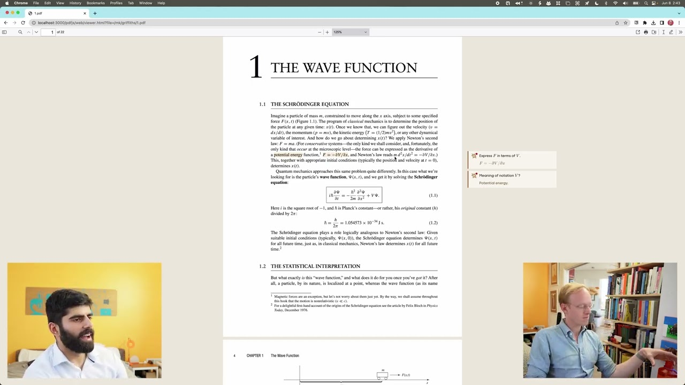

# 2026

Monorepo for my 2026 projects.

## ⭐ pdfcards

A local PDF reader with built-in highlighting and spaced repetition flashcards. Highlight text in any PDF, turn those highlights into flashcards, and review them with an SRS system (Again/Hard/Good/Easy). All data stored locally. Built in response to [Dwarkesh Patel and Andy Matuschak's conversation on studying and spaced repetition](https://www.youtube.com/watch?v=OFuu4pesKf0). Very early stages but it works.

[](https://www.youtube.com/watch?v=OFuu4pesKf0)

**Stack:** Bun · TypeScript · pdf.js

→ [browse code](./pdfcards)

## ⭐ sicp-notes

My notes and 80+ flashcards from working through [Structure and Interpretation of Computer Programs](https://mitp-content-server.mit.edu/books/content/sectbyfn/books_pres_0/6515/sicp.zip/index.html) (Abelson & Sussman), Chapter 1. Covers expressions, evaluation models, the substitution model, compound procedures, recursive vs iterative processes, tree recursion, and the connection between SICP's terminology and standard CS recursion concepts. Includes detailed reading notes and spaced repetition flashcards.

**Stack:** Scheme · Markdown

→ [browse code](./sicp-notes)

## ⭐ ralph-wiggum

```
                                                                 -=
                                      +%#-   :=#%#**%-
                                     ##+**************#%*-::::=*-
                                   :##***********************+***#
                                 :@#********%#%#******************#*
                                 :##*****%+-:::-%%%%%##************#:
                                   :#%###%%-:::+#*******##%%%*******#%*:
                                      -+%**#%%@@%%%%%%%%%#****#%##*##%%=
                                      -@@%%%%%%%%%%%%%%@*#%%#*##:::
                                    +%%%%%%%%%%%%%%@#+--=#--=#@+:
                                   -@@@@@%@@@@#%#=-=**--+*-----=#:
                                       :*     *-   - :#-:*=-----=#:
                                       %::%@- *:  *@# +::=*--#=:-%:
                                       #- =+**##-    =*:::#*#-++:*:
                                        #+:-::+--%***-::::::::-*##
                                      :+#:+=:-==-*:::::::::::::::-%
                                     *=::::::::::::::-=*##*:::::::-+
                                     *-::::::::-=+**+-+%%%%+:::::--+
                                      :*%##**==++%%%######%:::::--%-
                                        :-=#--%####%%%%@@+:::::--%=
                                        *:::+%%##%%#%%*:::::::-*#%-
                                        :@%*:::::::::::::::-=##*%%*%=
                                         %%%=--:::::---=+%%****%##@%#%%*:
                                      :*@%***@%%%###*********%%#%********%-
                                   :*%@*+*%*%%%%@*********%%**##****%=--#%*#
                                 :%#%#*+***#@%%%@%#%%%@%#*****%****%::::::##%-
                                :%*#%+*******%%%@#*************%****%-::::::**%=
                                %#*%#********#@%%@********%*%***#%**+*%-:::::*#*%:
                              +%#*@**********@%%%%*+***%-::::::#*%#****%#:::-%***%-
                               #-:+@#***+*@%**#%**********%%%#%%*****%::::::-#**%***************%
                               =%*****+%%+**@#%***********@%#%%#******%:::::%****@*********+****##
                                %*#%@#*+++**#%************%%%%%#********###*******@**************%:
                                =#**++***+**@************%%%%#%%*******************%*************##
                                 %*++******@#************@%%#%%@*******************#@*************@:
                                  #***+***%#*************@%%%%%@#*******************#%*************+
                                   +#***##%**************@%%%%%%%********************%************%
                                     :######***+**********%%%%%%%%*********************%************%
                                       :+%@#***********+*****#%@@%#******+***************#@*****+*****%:
                                         @*********************************************##*+**+*****#+
                                        =%%%%%@@@%%#**************************##%%@@@%%%@**********##

                                     "Bake 'em away, toys!" - Chief Wiggum
```

A tiny CLI tool that turns Claude Code into an autonomous task runner. Give it a PRD, run `./ralph-wiggum 10`, and it works through each task one by one: picks the highest priority item, implements it, commits, updates progress, and moves on. Uses [gum](https://github.com/charmbracelet/gum) for the terminal UI. Stops when the PRD is done or max iterations are hit.

**Stack:** Bash · Claude Code · gum

→ [browse code](./ralph-wiggum)

## ⭐ my-runs

A Hugo frontend for [plain-text-running-tracker](https://github.com/sasha-computer/plain-text-running-tracker), which parses Apple Health exports and Garmin FIT files into a markdown running log. This site takes that data and renders it as an interactive calendar view.

**Stack:** Hugo · HTML · CSS · JavaScript

→ [browse code](./my-runs)

## ⭐ plain-text-running-tracker

Parses Apple Health XML exports and Garmin FIT files into a simple markdown running log. Extracts every run with date, distance, duration, pace, and heart rate, then writes it all to a single `.md` file. No cloud, no accounts, just your data in plain text. Feeds into [my-runs](./my-runs) for the calendar view.

**Stack:** Python

→ [browse code](./plain-text-running-tracker)

## ⭐ Argus


Named after the hundred-eyed giant of Greek mythology. A debug tool for Boundless proof requests. Fetches a proof request from the BoundlessMarket contract on Base, downloads the guest program ELF (supports IPFS), and executes it locally in the RISC Zero zkVM in execute-only mode. Reports cycles, journal output, and any errors. Human-readable output by default, JSON with `--json` for scripting.

**Stack:** Rust · RISC Zero · Nix

→ [browse code](./argus)

## ⭐ immich-backup

Automated backup system for [Immich](https://immich.app/) photos. Pulls photos from a NAS over SSH (local or Tailscale), stages them locally, then archives to a LUKS-encrypted USB drive as compressed tarballs. Runs on a systemd timer so backups happen automatically. Includes install/uninstall scripts.

**Stack:** Bash · systemd · LUKS · rsync

→ [browse code](./immich-backup)

## ⭐ practice-problems

A collection of handwritten coding problems in Python and Scheme, worked through alongside [boot.dev](https://www.boot.dev/u/sasha-computer) courses and [SICP](https://mitp-content-server.mit.edu/books/content/sectbyfn/books_pres_0/6515/sicp.zip/index.html) Section 1. Memoized factorials with closures, currying, recursive joins, depth-weighted sums, valid parentheses generation, pattern matching on sum types, and more.

**Stack:** Python · Scheme

→ [browse code](./practice-problems)
