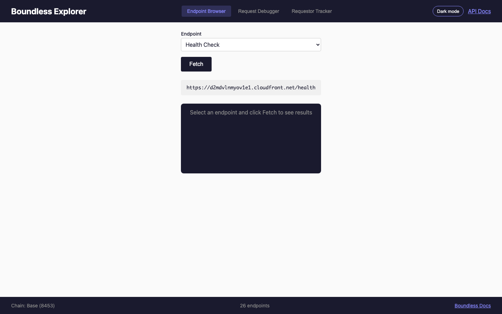
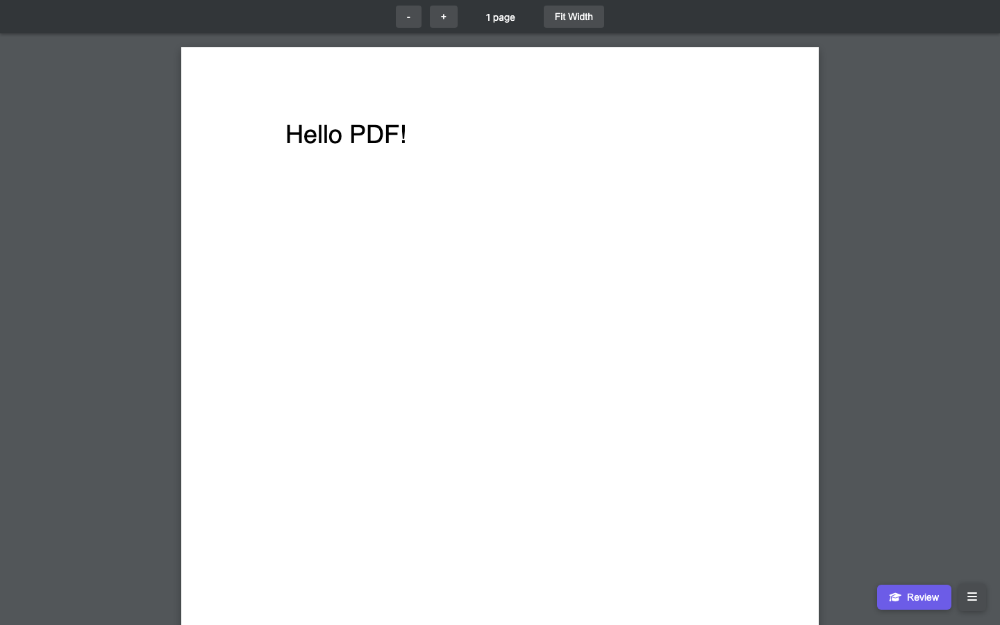

# 2026

Everything I built in 2026. Most recent first.

## ⭐ [pi-auto-router](https://github.com/sasha-computer/pi-auto-router)

A [pi](https://github.com/badlogic/pi-mono) extension that automatically routes prompts to the right model. Haiku classifies each prompt (~300ms, fractions of a cent), then switches to Sonnet or Opus before the agent runs. No more manual model switching.

**Stack:** TypeScript · pi extension

## ⭐ [pi-auto-summary](https://github.com/sasha-computer/pi-auto-summary)

Auto-save structured session logs when exiting pi. If the session was substantial (5+ exchanges), generates a summary and saves it as a markdown log. Auto-commits to git if you're in a repo.

**Stack:** TypeScript · pi extension

## ⭐ [raycast-goodies](https://github.com/sasha-computer/raycast-goodies)

Raycast script commands for display control, focus modes, search, DNS switching, and more. Small utilities that fill gaps in the default Raycast experience.

**Stack:** Bash · AppleScript

## ⭐ [sidebar](https://github.com/sasha-computer/sidebar)

Permanent macOS desktop sidebar pinned to the right edge of a widescreen monitor. Shows calendar, Todoist tasks, Spotify now playing, clipboard history, system stats, downloads, screenshots, and a quick note input. Built as a Svelte + Tailwind app inside a Hammerspoon webview. Auto-hides when undocked.

**Stack:** Svelte 5 · Tailwind v4 · Hammerspoon · Lua · Bun

## ⭐ [readwise-triage](https://github.com/sasha-computer/readwise-triage)

Tinder for your Readwise Reader inbox. Syncs your library to a local SQLite database, then shows articles one at a time as swipeable cards. Left to archive, right to keep. Down arrow gets an AI summary so you can decide without opening the article. Burns through a backlog of 200+ articles in a few minutes.

**Stack:** TypeScript · Bun · SQLite · OpenRouter

## ⭐ [pi-ghostty-sync](https://github.com/sasha-computer/pi-ghostty-sync)

Matching dark/light themes for pi and Ghostty that follow your system appearance. Three pairs (Catppuccin, Everforest, High Contrast) where the terminal and pi's TUI use the exact same hex values. Polls macOS appearance and switches both automatically.

**Stack:** TypeScript · pi extension

## ⭐ [x-likes](https://github.com/sasha-computer/x-likes)

Search your X/Twitter likes with fzf. Indexes 13K+ liked tweets in SQLite with full-text search so you can actually find that tweet you liked six months ago.

**Stack:** Python · SQLite · fzf

## ⭐ [plain-text-running-tracker](https://github.com/sasha-computer/plain-text-running-tracker)

Parses Apple Health XML exports and Garmin FIT files into a single markdown file. Every run with date, distance, duration, pace, and heart rate. No cloud accounts, no subscriptions, just a `.md` file you can read, search, and version control. Plain text is forever.

**Stack:** Python · uv

## ⭐ [pif](https://github.com/sasha-computer/pif)

Run a command. If it fails, send the output to [pi](https://github.com/badlogic/pi-mono) for help. That's it.

**Stack:** Python · uv

## ⭐ [pi-chat-fzf](https://github.com/sasha-computer/pi-chat-fzf)

Fuzzy find and resume pi coding agent sessions. Indexes every message across all sessions so you can find that thing you worked on three days ago by typing a few words you remember.

**Stack:** Python · uv · fzf

## ⭐ [domain-search](https://github.com/sasha-computer/domain-search)

Searches for available domains across basically every TLD right in the terminal. No API keys, no paid services. Uses DNS + RDAP checks with async lookups, finds domain hacks (e.g. `creati.ve`), and exports results to JSON/CSV.

**Stack:** Python · asyncio · uv

## ⭐ [claude-code-usage](https://github.com/sasha-computer/claude-code-usage)

See your Claude Code rate limits in the macOS menu bar. Shows 5-hour and weekly usage percentages, color-coded so you know at a glance how close you are.

**Stack:** Swift · macOS 14+

## ⭐ sicp-notes

My notes and 80+ flashcards from working through [Structure and Interpretation of Computer Programs](https://mitp-content-server.mit.edu/books/content/sectbyfn/books_pres_0/6515/sicp.zip/index.html) (Abelson & Sussman), Chapter 1. Covers expressions, evaluation models, the substitution model, compound procedures, recursive vs iterative processes, tree recursion, and the connection between SICP's terminology and standard CS recursion concepts.

**Stack:** Scheme · Markdown

→ [browse code](./sicp-notes)

## ⭐ practice-problems

A collection of handwritten coding problems in Python and Scheme, worked through alongside [boot.dev](https://www.boot.dev/u/sasha-computer) courses and [SICP](https://mitp-content-server.mit.edu/books/content/sectbyfn/books_pres_0/6515/sicp.zip/index.html) Section 1. Memoized factorials with closures, currying, recursive joins, depth-weighted sums, valid parentheses generation, pattern matching on sum types, and more.

**Stack:** Python · Scheme

→ [browse code](./practice-problems)

## ⭐ Argus


Named after the hundred-eyed giant of Greek mythology. A debug tool for Boundless proof requests. Fetches a proof request from the BoundlessMarket contract on Base, downloads the guest program ELF (supports IPFS), and executes it locally in the RISC Zero zkVM in execute-only mode. Reports cycles, journal output, and any errors. Human-readable output by default, JSON with `--json` for scripting.

**Stack:** Rust · RISC Zero · Nix

→ [browse code](./argus)

## ⭐ japan-trip

A trip planner I built for my 16-day Japan trip (Tokyo, Kanazawa, Takayama, Kyoto, Hiroshima). Day-by-day itinerary with morning/afternoon/evening schedules, interactive map with routes between cities, places list with categories (food, coffee, nature, activities), budget tracker, and a drag-and-drop planner. All data driven from JSON files so it's easy to tweak.


**Stack:** React · TypeScript · Vite · Tailwind · Google Maps API

→ [browse code](./japan-trip)

## ⭐ [runelite-firemaking](https://github.com/sasha-computer/runelite-firemaking)

RuneLite plugin that tracks firemaking session stats. XP, logs burned, time elapsed. The important things in life.

**Stack:** Java · RuneLite

## ⭐ ralph-wiggum

```
                                                                 -=
                                      +%#-   :=#%#**%-
                                     ##+**************#%*-::::=*-
                                   :##***********************+***#
                                 :@#********%#%#******************#*
                                 :##*****%+-:::-%%%%%##************#:
                                   :#%###%%-:::+#*******##%%%*******#%*:
                                      -+%**#%%@@%%%%%%%%%#****#%##*##%%=
                                      -@@%%%%%%%%%%%%%%@*#%%#*##:::
                                    +%%%%%%%%%%%%%%@#+--=#--=#@+:
                                   -@@@@@%@@@@#%#=-=**--+*-----=#:
                                       :*     *-   - :#-:*=-----=#:
                                       %::%@- *:  *@# +::=*--#=:-%:
                                       #- =+**##-    =*:::#*#-++:*:
                                        #+:-::+--%***-::::::::-*##
                                      :+#:+=:-==-*:::::::::::::::-%
                                     *=::::::::::::::-=*##*:::::::-+
                                     *-::::::::-=+**+-+%%%%+:::::--+
                                      :*%##**==++%%%######%:::::--%-
                                        :-=#--%####%%%%@@+:::::--%=
                                        *:::+%%##%%#%%*:::::::-*#%-
                                        :@%*:::::::::::::::-=##*%%*%=
                                         %%%=--:::::---=+%%****%##@%#%%*:
                                      :*@%***@%%%###*********%%#%********%-
                                   :*%@*+*%*%%%%@*********%%**##****%=--#%*#
                                 :%#%#*+***#@%%%@%#%%%@%#*****%****%::::::##%-
                                :%*#%+*******%%%@#*************%****%-::::::**%=
                                %#*%#********#@%%@********%*%***#%**+*%-:::::*#*%:
                              +%#*@**********@%%%%*+***%-::::::#*%#****%#:::-%***%-
                               #-:+@#***+*@%**#%**********%%%#%%*****%::::::-#**%***************%
                               =%*****+%%+**@#%***********@%#%%#******%:::::%****@*********+****##
                                %*#%@#*+++**#%************%%%%%#********###*******@**************%:
                                =#**++***+**@************%%%%#%%*******************%*************##
                                 %*++******@#************@%%#%%@*******************#@*************@:
                                  #***+***%#*************@%%%%%@#*******************#%*************+
                                   +#***##%**************@%%%%%%%********************%************%
                                     :######***+**********%%%%%%%%*********************%************%
                                       :+%@#***********+*****#%@@%#******+***************#@*****+*****%:
                                         @*********************************************##*+**+*****#+
                                        =%%%%%@@@%%#**************************##%%@@@%%%@**********##

                                     "Bake 'em away, toys!" - Chief Wiggum
```

A tiny CLI tool that turns Claude Code into an autonomous task runner. Give it a PRD, run `./ralph-wiggum 10`, and it works through each task one by one: picks the highest priority item, implements it, commits, updates progress, and moves on. Uses [gum](https://github.com/charmbracelet/gum) for the terminal UI. Stops when the PRD is done or max iterations are hit.

**Stack:** Bash · Claude Code · gum

→ [browse code](./ralph-wiggum)

## ⭐ gandalf

My fork of [NanoClaw](https://github.com/gavrielc/nanoclaw), a personal Claude assistant that lives in WhatsApp/Discord. Started as experimentation on top of the original project and evolved into a significantly reworked version. Key changes I made:

- Ripped out Apple Container and replaced with native subprocess execution for simplicity and reliability
- Added a durable memory store with QMD memory search, so the assistant actually remembers things across conversations
- Built per-group message queues with SQLite state and graceful shutdown
- Migrated the runtime to Bun
- Added structured agent output to fix infinite retry loops on silent responses
- Simplified the privilege model and made routing always-on
- Various reliability fixes: message loss prevention, proper error handling, container lifecycle management

This was part of my broader experimentation with building a personal AI agent (OpenClaw) that works across different chat platforms.

**Stack:** TypeScript · Bun · SQLite · Claude API

→ [browse code](./gandalf)

## ⭐ explorer-api

Clients for the [Boundless Indexer API](https://d2mdvlnmyov1e1.cloudfront.net/docs/) on Base. A Svelte 5 web app for exploring API endpoints interactively, plus a Cloudflare Workers deployment with Terraform-managed Access policies. Covers all 31 endpoints with documentation on which ones work, which return empty data, and which are broken.



**Stack:** Svelte 5 · TypeScript · Bun · Cloudflare Workers · Terraform · Supabase

→ [browse code](./explorer-api)

## ⭐ my-runs

A Hugo frontend for [plain-text-running-tracker](https://github.com/sasha-computer/plain-text-running-tracker), which parses Apple Health exports and Garmin FIT files into a markdown running log. This site takes that data and renders it as an interactive calendar view.


**Stack:** Hugo · HTML · CSS · JavaScript

→ [browse code](./my-runs)

## ⭐ pdfcards

A local PDF reader with built-in highlighting and spaced repetition flashcards. Highlight text in any PDF, turn those highlights into flashcards, and review them with an SRS system (Again/Hard/Good/Easy). All data stored locally. Built in response to [Dwarkesh Patel and Andy Matuschak's conversation on studying and spaced repetition](https://www.youtube.com/watch?v=OFuu4pesKf0). Very early stages but it works.

[](https://www.youtube.com/watch?v=OFuu4pesKf0)



**Stack:** Bun · TypeScript · pdf.js

→ [browse code](./pdfcards)
